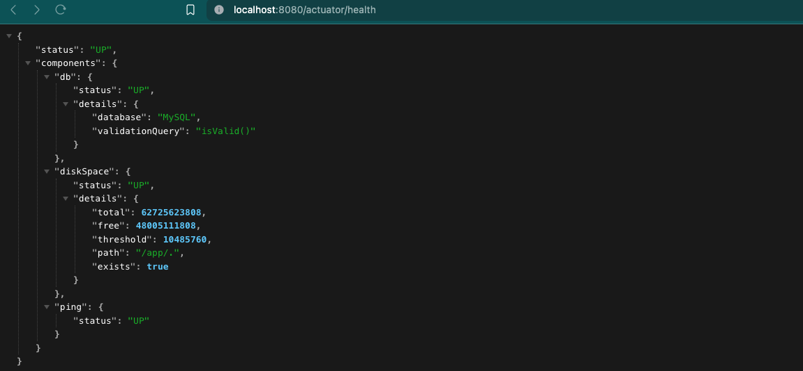
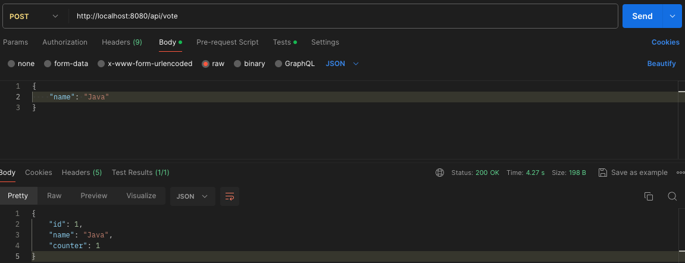
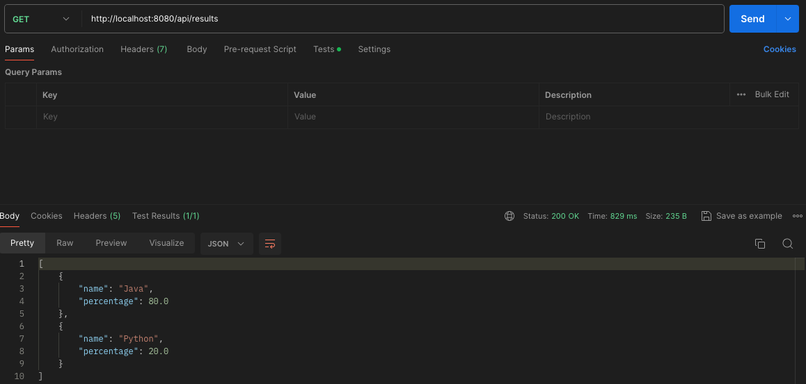

# Sring Boot & Hibernate App

## Introduction
This repository contains a Java application built with Spring Boot and Hibernate. The application is designed to 
manage voting for different programming languages. It includes endpoints for voting and retrieving results, and it's 
fully dockerized for easy deployment.

## Environment
- Java Runtime version: 17.0.11+1-b1207.24 x86_64
- VM: OpenJDK 64-Bit Server VM by JetBrains s.r.o.

## Approach
Spring Boot is used as the framework for building the application. The Spring Boot Starter Web is used to build the
RESTful web services and the Spring Boot Starter Data JPA is used for data persistance with Hibernate.

Hibernate is used as the ORM tool to handle database interactions. It maps Java objects to 
database tables and manages database operations in a more object-oriented way.

- Entity Classes: Java classes are annotated with @Entity to represent database tables. For example, Language is an 
entity class that maps to a languages table.
- Repository Layer: LanguageRepository extends JpaRepository to provide CRUD operations and custom queries.
- Service Layer: LanguageService and ResultsService are used to encapsulate the business logic and interact with the 
repository layer.

## How to run
The application is dockerized and uses Docker Compose to manage the containers. It includes a Docker image for the database and another for the application.

1. **Build the project**:
to compile and package the application before running Docker Compose execute:
```
mvn clean package
```
2. **Start the application**:
to build the Docker images and start the application along with the MySQL database run:
```
docker-compose up --build
```

After running docker-compose you can check the health of the application by accessing the following URL:
http://localhost:8080/actuator/health

You should get a message like the following:


## Endpoints

The application provides the following main endpoints:

- **POST /api/vote**: increase the vote count for a language. 

Example request payload:

```json
{
    "name": "Java"
}
```

- **GET /api/results**: retrieve the results with the percentage of votes for each language.


Additionally, the application includes custom CRUD operations for managing languages:

- **POST /api/language**: Save a new language. Example request payload:
```json
{
"name": "Python",
"counter": 0
}
```

- **GET /api/language**: Retrieve all languages.

- **GET /api/language/{id}**: Retrieve a specific language by ID.

- **PUT /api/language/{id}**: Update a specific language by ID. Example request payload:

- **POST /api/language**: Save a new language. Example request payload:
```json
{
"name": "JavaScript",
"counter": 10
}
```
- **DELETE /api/language/{id}**: Delete a specific language by ID.


## Testing
The application includes Spring Boot Actuator for monitoring and health checks. You can check the health of the 
app by accessing: 

http://localhost:8080/actuator/health

The project includes unit tests with 100% coverage for the controller and service modules.

JaCoCo is used for measuring code coverage of the tests. It provides detailed reports on which parts of the code 
are covered by tests, helping to identify untested parts of the codebase.

JaCoCo coverage report:


## Possible Improvements
- Add authentication and authorization: implement security measures to restrict access to the endpoints based on user 
roles.
- Enhance error handling: improve error handling to provide more detailed and user-friendly error messages.
- Add more endpoints: adding more endpoints for additional functionality, such as updating or deleting votes.
- Improve performance: optimize database queries and application performance, especially for handling a large number of 
votes.
- Documentation: expand the documentation to include detailed API specifications, usage examples, and developer 
guidelines.

  
### Postman testing examples





